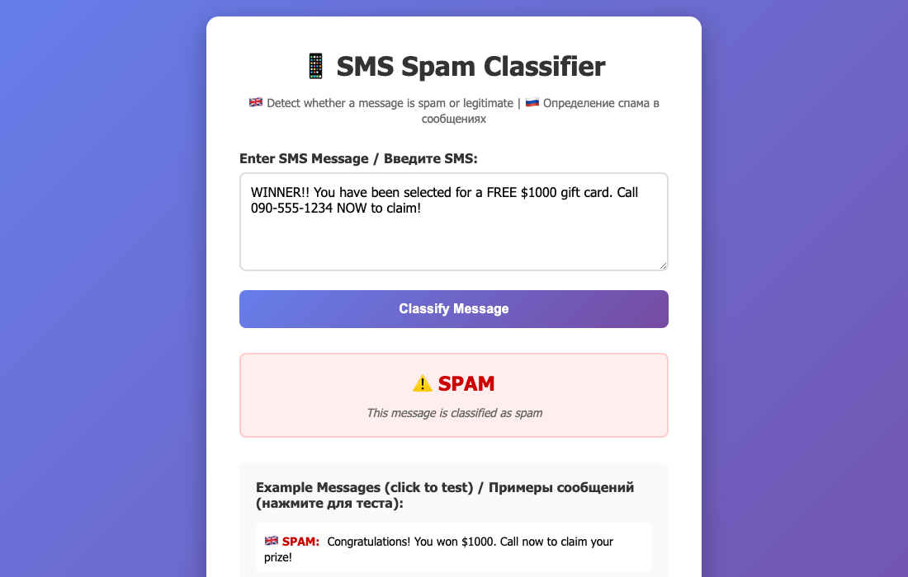
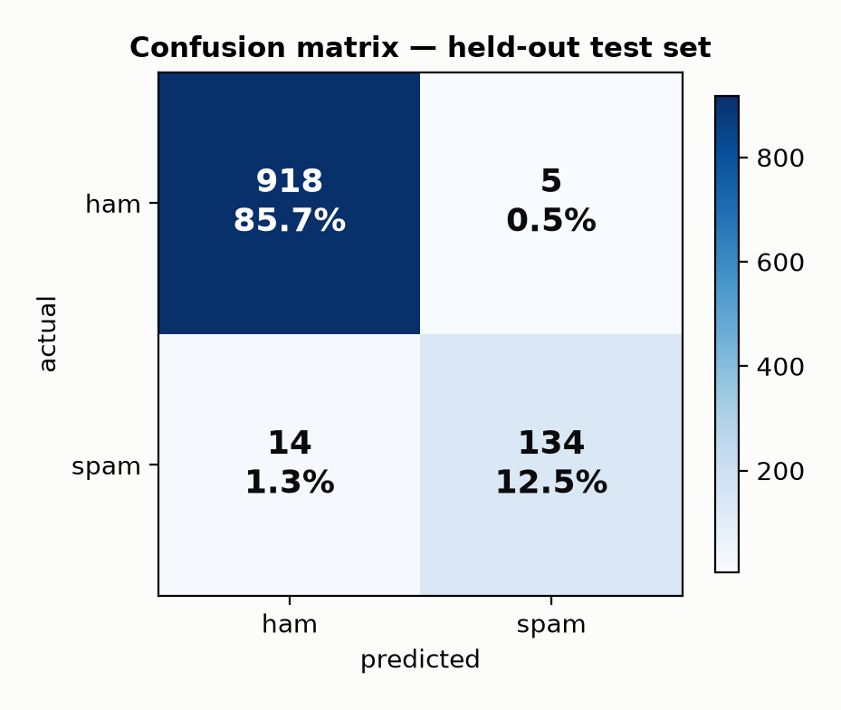
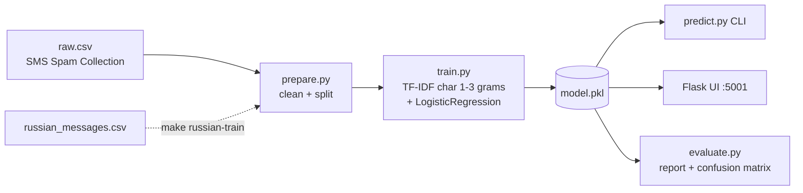

# MLFindSpam

[](https://github.com/loguntsovae/MLFindSpam/actions/workflows/ci.yml)


**Multilingual (EN + RU) SMS spam classifier** — TF-IDF character n-grams + Logistic Regression. **98.2% accuracy on the held-out test set**, full train/eval pipeline in one `make all`, web UI included.

<table>
<tr>
<td width="55%">



</td>
<td>



</td>
</tr>
</table>

## Measured performance (not hand-waved)

```
              precision    recall  f1-score   support
         ham      0.985     0.995     0.990       923
        spam      0.964     0.905     0.934       148
    accuracy                          0.982      1071
```

Reproduce: `make all && python -m src.evaluate` — regenerates the report and the confusion matrix above from the held-out split.

## Why character n-grams

Word-level features fall apart on SMS text: obfuscation ("fr33", "w1nner"), typos, and mixed Cyrillic/Latin defeat token matching. Character `(1,3)`-grams survive all three — and make one model work for **both English and Russian** without language detection.

## Quick start

```bash
pip install -r requirements.txt
make all          # prepare data → train → run 20 tests
python src/predict.py "WINNER! You won $1000, call now!"   # → spam
python src/predict.py "СРОЧНО! Вы выиграли iPhone!"        # → spam
make run-ui       # web UI on http://localhost:5001
```

## Pipeline



**One correctness detail worth noting:** inference applies the *same* `clean_text` as training. The vectorizer was fitted on cleaned text — feeding it raw text is a silent feature-distribution skew that costs accuracy without ever throwing an error.

## Project structure

```
src/
  prepare.py             # data cleaning + train/test split
  train.py               # model training
  evaluate.py            # held-out metrics + confusion matrix figure
  predict.py             # inference (CLI)
  merge_russian_data.py  # extend dataset with Russian messages
data/                    # SMS Spam Collection (5 574 msgs) + Russian examples
tests/                   # 20 pytest cases: predictions, edge cases, cleaning
ui/                      # Flask web app
```

## License

MIT
